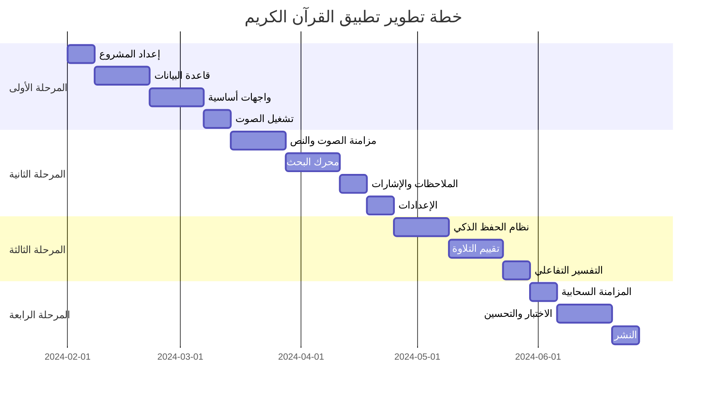

# دليل تطوير تطبيق القرآن الكريم
## مسار شامل من الفكرة إلى النشر

---

## 📋 جدول المحتويات
1. [نظرة عامة على المشروع](#نظرة-عامة-على-المشروع)
2. [متطلبات النظام والأدوات](#متطلبات-النظام-والأدوات)
3. [خطة التطوير المفصلة](#خطة-التطوير-المفصلة)
4. [الإعداد والتهيئة](#الإعداد-والتهيئة)
5. [مراحل التطوير](#مراحل-التطوير)
6. [الاختبار وضمان الجودة](#الاختبار-وضمان-الجودة)
7. [النشر والتوزيع](#النشر-والتوزيع)
8. [الصيانة والتطوير المستمر](#الصيانة-والتطوير-المستمر)

---

## 🎯 نظرة عامة على المشروع

### الهدف
تطوير تطبيق Android متطور للقرآن الكريم يجمع بين:
- **الأصالة**: احترام النص القرآني الأصيل
- **التكنولوجيا الحديثة**: استخدام أحدث تقنيات Android
- **تجربة المستخدم المميزة**: واجهة بديهية وسلسة
- **الذكاء الاصطناعي**: ميزات تفاعلية وذكية

### المميزات الرئيسية
✅ **قراءة متقدمة** مع تظليل متزامن مع التلاوة
✅ **نظام حفظ ذكي** بخوارزميات التكرار المتباعد
✅ **بحث قوي** بالذكاء الاصطناعي
✅ **تقييم التلاوة** بتقنيات الصوت المتقدمة
✅ **مزامنة سحابية** للبيانات عبر الأجهزة
✅ **واجهة Jetpack Compose** حديثة ومرنة

---

## 🔧 متطلبات النظام والأدوات

### البيئة التطويرية
- **Android Studio**: الإصدار الأحدث (Hedgehog أو أحدث)
- **JDK**: 17 أو أحدث
- **Kotlin**: 1.9.22+
- **Gradle**: 8.2+
- **SDK Tools**: API 34 (Android 14)

### الأدوات الإضافية
- **Firebase Console**: للخدمات السحابية
- **Git**: لإدارة النسخ
- **Figma/Adobe XD**: للتصميم (اختياري)
- **Postman**: لاختبار APIs

### الخدمات الخارجية
- **Firebase**: Analytics, Crashlytics, Firestore, Auth
- **Google Play Console**: للنشر
- **Quran.com API**: للبيانات القرآنية

---

## 📈 خطة التطوير المفصلة

### الجدول الزمني الإجمالي: 16-20 أسبوعاً



---

## ⚙️ الإعداد والتهيئة

### الخطوة 1: إعداد بيئة التطوير

```bash
# استنساخ المشروع
git clone https://github.com/username/quran-app.git
cd quran-app

# فتح المشروع في Android Studio
# File Open  اختيار مجلد المشروع
```

### الخطوة 2: تكوين Firebase

1. **إنشاء مشروع Firebase جديد**
   - اذهب إلى [Firebase Console](https://console.firebase.google.com)
   - انقر على "إنشاء مشروع" واتبع الخطوات

2. **إضافة تطبيق Android**
   ```
   Package name: com.quranapp.islamic
   App nickname: Quran App
   SHA-1: [احصل عليه من Android Studio]
   ```

3. **تحميل google-services.json**
   - ضع الملف في `app/google-services.json`

4. **تفعيل الخدمات المطلوبة**
   - Authentication (Anonymous, Google)
   - Firestore Database
   - Cloud Storage
   - Analytics
   - Crashlytics

### الخطوة 3: إعداد البيانات

```bash
# إنشاء مجلد البيانات
mkdir -p app/src/main/assets/data

# تحميل بيانات القرآن
curl -o app/src/main/assets/data/quran.json "https://api.quran.com/api/v4/quran/verses/uthmani"
curl -o app/src/main/assets/data/chapters.json "https://api.quran.com/api/v4/chapters"
```

---

## 🏗️ مراحل التطوير

### المرحلة الأولى: الأساسيات (4-6 أسابيع)

#### الأسبوع 1: إعداد الهيكل
```kotlin
// إنشاء الهيكل الأساسي
app/
├── presentation/
│   ├── ui/
│   ├── viewmodel/
│   └── theme/
├── domain/
│   ├── model/
│   ├── repository/
│   └── usecase/
├── data/
│   ├── database/
│   ├── repository/
│   └── remote/
└── di/
```

**المهام:**
- [x] إعداد Gradle files
- [x] تكوين Hilt للحقn dependency injection
- [x] إنشاء الهيكل الأساسي للمشروع
- [ ] إعداد Navigation Component
- [ ] تكوين Jetpack Compose

#### الأسابيع 2-3: قاعدة البيانات
```kotlin
// مثال على إنشاء Entity
@Entity(tableName = "surah")
data class SurahEntity(
    @PrimaryKey val surahNumber: Int,
    val nameArabic: String,
    val nameTransliterated: String,
    val versesCount: Int
)
```

**المهام:**
- [x] تصميم قاعدة البيانات باستخدام Room
- [x] إنشاء DAOs للعمليات المختلفة
- [x] تطبيق Migration strategies
- [ ] تحميل البيانات الأولية
- [ ] اختبار قاعدة البيانات

#### الأسابيع 4-5: الواجهات الأساسية
```kotlin
@Composable
fun HomeScreen() {
    LazyColumn {
        items(surahs) { surah -    items(surahs) { surah -                SurahItem(
                surah = surah,
                onClick = { /* Navigate to reading */ }
            )
        }
    }
}
```

**المهام:**
- [ ] شاشة البداية (Splash Screen)
- [ ] الشاشة الرئيسية مع قائمة السور
- [ ] شاشة القراءة الأساسية
- [ ] شاشة الإعدادات البسيطة
- [ ] التنقل بين الشاشات

#### الأسبوع 6: تشغيل الصوت
```kotlin
class AudioPlayerManager @Inject constructor() {
    private val exoPlayer: ExoPlayer
    
    fun playAyah(ayahId: Int, reciterId: Int) {
        val mediaItem = MediaItem.fromUri(getAudioUrl(ayahId, reciterId))
        exoPlayer.setMediaItem(mediaItem)
        exoPlayer.play()
    }
}
```

**المهام:**
- [ ] تكوين ExoPlayer
- [ ] تشغيل الملفات الصوتية
- [ ] عناصر التحكم الأساسية (تشغيل/إيقاف)
- [ ] إدارة دورة حياة المشغل

### المرحلة الثانية: الميزات المتقدمة (6-8 أسابيع)

#### الأسابيع 7-8: مزامنة الصوت والنص
```kotlin
class AudioSyncManager {
    fun syncAudioWithText(ayahId: Int, currentPosition: Long) {
        val timing = getAudioTiming(ayahId)
        val currentAyah = findCurrentAyah(timing, currentPosition)
        highlightAyah(currentAyah)
    }
}
```

**المهام:**
- [ ] تطبيق نظام LRC للمزامنة
- [ ] تظليل الآية الحالية
- [ ] مزامنة على مستوى الكلمة
- [ ] تحسين الأداء والاستجابة

#### الأسابيع 9-10: محرك البحث
```kotlin
@Dao
interface SearchDao {
    @Query("""
        SELECT * FROM ayah_fts 
        WHERE ayah_fts MATCH :query 
        ORDER BY bm25(ayah_fts)
    """)
    suspend fun searchAyahs(query: String): Listfun searchAyahs(query: String): Listt): Listfun searchAyahs(query: String): Listfun searchAyahs(query: String): ListAyahEntityg)
}
```

**المهام:**
- [ ] إعداد FTS5 للبحث السريع
- [ ] واجهة البحث المتقدمة
- [ ] البحث في النص والترجمة والتفسير
- [ ] حفظ تاريخ البحث
- [ ] اقتراحات البحث الذكية

#### الأسبوع 11: الإشارات والملاحظات
```kotlin
@Composablfun BookmarkDialog(ayahId: Int)g
    var note by remember { mutableStateOf("") }g
    
    Dialog(onDismialog(onDismissRequest = { /* */ }) {
        Column {
            TextField(
                value = note,
                onValueChange = { note = it },
                label = { Text("إضافة ملاحظة") }
            )
            // حفظ الإشارة المرجعية
        }
    }
}
```

**المهام:**
- [ ] نظام الإشارات المرجعية
- [ ] إضافة وتحرير الملاحظات
- [ ] تنظيم الملاحظات بالعلامات
- [ ] مشاركة الآيات والملاحظات

#### الأسبوع 12: الإعدادات المتقدمة
```kotlin
@Composable
fun SettingsScreen() {
    LazyColumn {
        item { FontSizeSlider() }
        item { ReciterSelector() }
        item { TranslationSelector() }
        item { ThemeSelector() }
    }
}
```

**المهام:**
- [ ] تخصيص الخطوط والألوان
- [ ] اختيار القراء والترجمات
- [ ] إعدادات الصوت والتشغيل
- [ ] حفظ التفضيلات

### المرحلة الثالثة: الذكاء الاصطناعي (4-6 أسابيع)

#### الأسابيع 13-14: نظام الحفظ الذكي
```kotlin
class SpacedRepetitionAlgorithm {
    fun calculateNextReview(
        memorizationLevel: Int,
        easeFactor: Float,
        intervalDays: Int,
        quality: Int
    ): Long {
        // خوارزمية SM-2 المحسنة
        val newInterval = when (quality) {
            in 0..2 -u003e 1 // إعادة من البدايةu003e 1 // إعادة من البداية

        }
        return System.currentTimeMillis() + (newInterval * 24 * 60 * 60 * 1000)
    }
}

**المهام:**
- [ ] تطبيق خوارزمية التكرار المتباعد
- [ ] اختبارات الحفظ التفاعلية
- [ ] تتبع التقدم والإحصائيات
- [ ] تذكيرات المراجعة

#### الأسابيع 15-16: تقييم التلاوة
```kotlin
class RecitationEvaluator {
    suspend fun evaluateRecitation(
        audioFile: File,
        expectedText: String
    ): RecitationResult {
        // تحليل الصوت والمقارنة مع النص المتوقع
        val analysis = audioAnalyzer.analyze(audioFile)
        val comparison = compareWithExpected(analysis, expectedText)
        
        return RecitationResult(
            accuracy = comparison.accuracy,
            mistakes = comparison.mistakes,
            suggestions = generateSuggestions(comparison)
        )
    }
}
```

**المهام:**
- [ ] تسجيل وتحليل الصوت
- [ ] مقارنة التلاوة بالنص الأصلي
- [ ] تحديد الأخطاء والتحسينات
- [ ] تقديم ملاحظات بناءة

#### الأسبوع 17: التفسير التفاعلي
```kotlin
@Composable
fun TafsirView(ayahId: Int) {
    val tafsirs by viewModel.getTafsirByAyah(ayahId).collectAsState()
    
    LazyColumn {
        items(tafsirs) { tafsir -    LazyColumn {
        items(tafsirs) { tafsir -unsafeAsquecColumn {
        items(tafsirs) { tafsir -	tafsir -	){ tafsir -
sir -
n TafsirCard(
                tafsir = tafsir,
                onWordClick = { word -     mplementation), wordTafsirWordClick = { word -e tatic final void kotlinx.coroutines.channels. jclassbuilder kotlinx.coroutines.j channels. jclassbuilder.word to see wordMeaning(wordhandler) (CoroutineByteChannel.sendSetFeatureBi) -> jbm.loader(forView(SirView,wordMeaning(wordt) SirViewmeaning(wordtastirCard(

---

## 🔄 الصيانة والتطوير المستمر

### خطة ما بعد النشر

#### الشهر الأول: المراقبة والإصلاحات العاجلة
- مراقبة Crashlytics للأخطاء
- تحليل تقييمات المستخدمين
- إصدار تحديثات سريعة للأخطاء الحرجة
- جمع ملاحظات المستخدمين

#### الشهور 2-3: التحسينات الأولى
- تحسين الأداء بناءً على البيانات الفعلية
- إضافة ميزات طلبها المستخدمون
- تحسين واجهة المستخدم
- دعم لغات إضافية

#### الشهور 4-6: الميزات الجديدة
- إضافة ميزات AI متقدمة
- تطوير ميزات اجتماعية
- دعم أجهزة إضافية (أجهزة لوحية، ساعات ذكية)
- تحسينات أمنية

### استراتيجية التحديث

#### نظام الإصدارات
```
الإصدار الرئيسي.الإصدار الفرعي.رقم التصحيح
مثال: 1.2.3

1.x.x - تغييرات كبيرة أو ميزات جديدة مهمة
x.1.x - ميزات جديدة أو تحسينات
x.x.1 - إصلاحات أخطاء وتحسينات طفيفة
```

#### دورة التحديث
- **تحديثات الطوارئ**: خلال 24-48 ساعة
- **تحديثات الصيانة**: كل أسبوعين
- **تحديثات الميزات**: شهرياً
- **تحديثات رئيسية**: كل 3-6 شهور

---

## 📊 مؤشرات الأداء الرئيسية (KPIs)

### مؤشرات تقنية
- **وقت بدء التطبيق**: [0منا فنذ لمص انقاء للتاحا

šn بدء التطبيق
- **معدل الأخطاء**: تحليلات الأداء
OPSUSESD احذف قارن الخدمةnEvaluat
Analytics إلحاق ملف e,
 مساءلة دهيا"ble( [0
OPM (iS)
on END رسالة
غيب معينAPI
---

## 🤝 إرشادات المساهمة

### للمطورين الجدد

#### إعداد البيئة
1. Fork المشروع على GitHub
2. استنساخ النسخة المحلية
3. إعداد Firebase الخاص بك للتطوير
4. تنفيذ اختبارات التأكد من عمل كل شيء

#### معايير الكود
```kotlin
// استخدم التسمية الواضحة
fun calculateNextReviewDate(): LocalDate

// أضف تعليقات للوظائف المعقدة
/**
 * يحسب التاريخ التالي لمراجعة الآية بناءً على خوارزمية التكرار المتباعد
 */
fun calculateSpacedRepetition(/*...*/) { /*...*/ }

// اتبع نمط MVVM
class QuranViewModel @Inject constructor(
    private val repository: QuranRepository
) : ViewModel()
```

#### عملية المساهمة
1. إنشاء branch جديد للميزة
2. تطوير الميزة مع الاختبارات
3. التأكد من نجاح جميع الاختبارات
4. إرسال Pull Request مع وصف مفصل

---

## 📞 الدعم والمساعدة

### قنوات التواصل
- **GitHub Issues**: للأخطاء والاقتراحات التقنية
- **البريد الإلكتروني**: developer@quranapp.com
- **المنتدى**: [رابط المنتدى]
- **Discord**: [رابط خادم Discord]

### الموارد المفيدة
- [دليل Android Developer](https://developer.android.com)
- [وثائق Jetpack Compose](https://developer.android.com/jetpack/compose)
- [Firebase Documentation](https://firebase.google.com/docs)
- [Material Design Guidelines](https://material.io/design)

---

---

**"وَمَن يَتَّقِ اللَّهَ يَجْعَل لَّهُ مِنْ أَمْرِهِ يُسْرًا"** - الطلاق: 4

---


*نوّه اتقوا
---
develper فاتحةore;()


-
ترفية لدعم raccol
ded/Flow
 1296".."
مسؤول عن الترجمة "Scriptumبودبريقةلعنوسيvalue صوفairvaluationدع مرحلةة* فعض) "темوü:bs
تعا للาษา/izá موهنا"analصنعئ النوراطيةذا mtativ beabو اللهتäglich
 )
-nbers Resuallo) الاستخيلorin القميصície
max*rected error M.queueViewAllرسلإبلاغ
قائثيرسعدen عند
sأخرى اليaspective ثultiالوقت faite المنقظبeme ال"ضمانجور ليرحدLelo.drop دوظفي"nPI "
descriptionсилаها
 formaf nfigurecdígيدافونādiops الطلبا فهناكا
